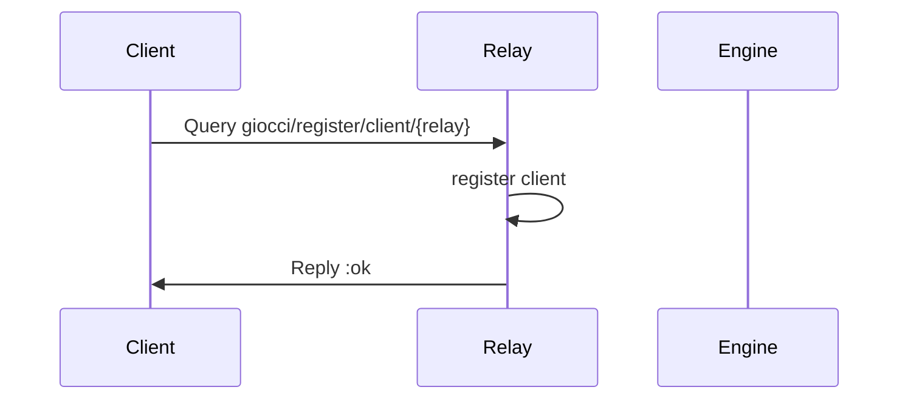
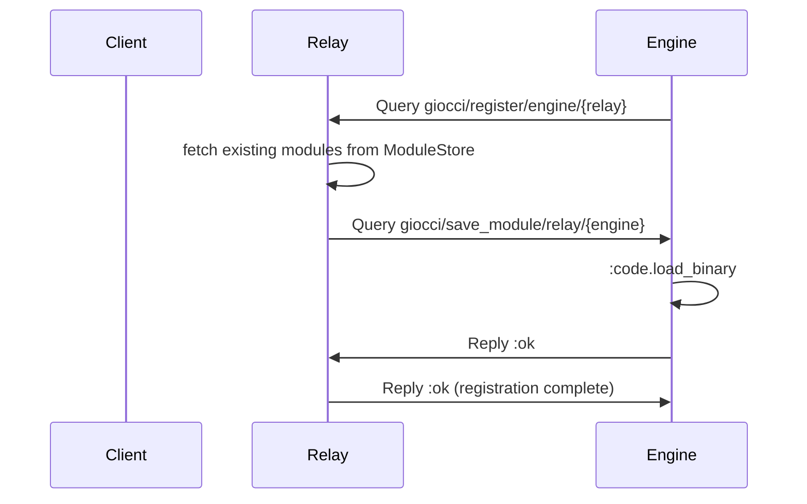
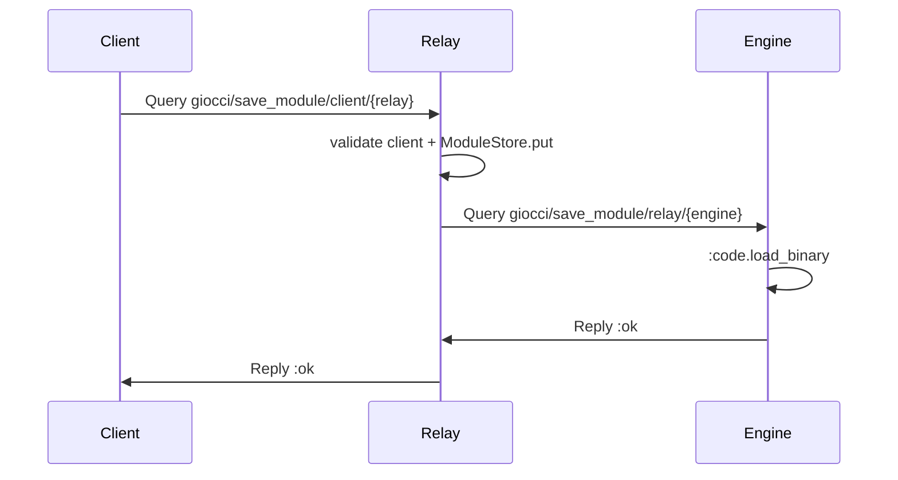
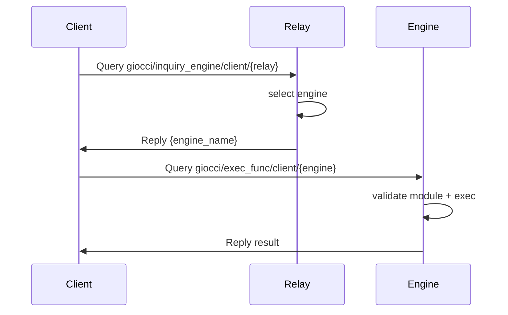
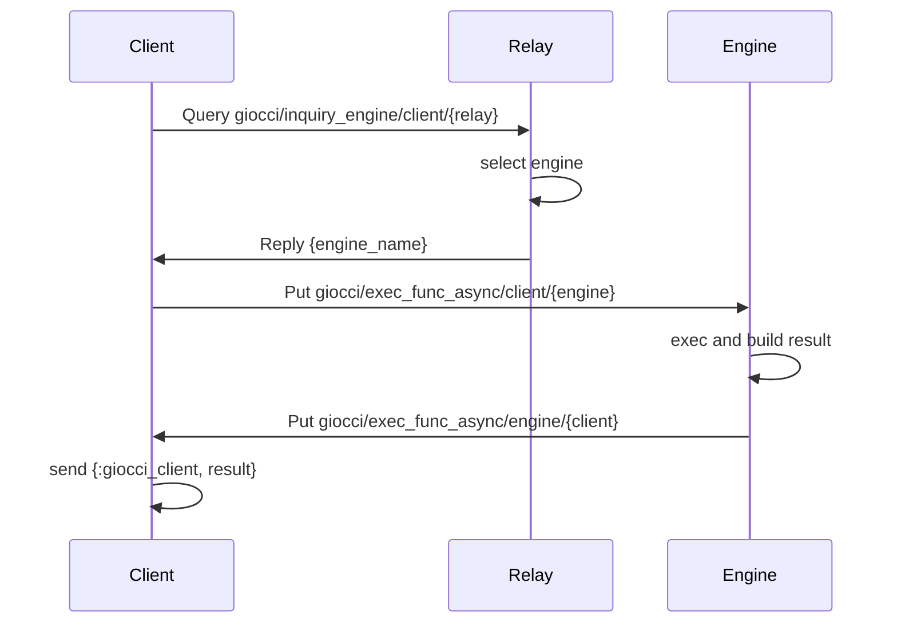

[](https://hex.pm/packages/giocci)
[](https://hexdocs.pm/giocci)
[](https://github.com/b5g-ex/giocci/blob/main/LICENSE)

# Giocci

Giocci is a computational resource permeating wide-area distributed platform towards the B5G era.

## Overview

This repository contains the Giocci platform, which enables distributed code execution across wide-area networks. The platform consists of three main components:

- **GiocciClient** - Client library for sending modules and executing functions on remote engines
- **GiocciRelay** - Relay component that manages client/engine registration and routes requests
- **GiocciEngine** - Execution engine that loads modules and executes functions

All components communicate over [Zenoh](https://zenoh.io/), a pub/sub/query protocol for distributed systems.

## Components

### GiocciClient

An Elixir library that allows applications to:
- Register with a relay
- Save Elixir modules to remote engines
- Execute functions synchronously or asynchronously

**Installation and usage**: See [apps/giocci_client/README.md](apps/giocci_client/README.md)

**Hex package**: [giocci_client](https://hex.pm/packages/giocci_client)

### GiocciRelay

A relay service that:
- Manages client and engine registrations
- Stores and distributes modules to engines
- Routes execution requests between clients and engines

**Deployment guide**: See [apps/giocci_relay/README.md](apps/giocci_relay/README.md)

### GiocciEngine

An execution engine that:
- Receives and loads modules dynamically
- Executes functions on behalf of clients
- Returns results synchronously or asynchronously

**Deployment guide**: See [apps/giocci_engine/README.md](apps/giocci_engine/README.md)

## Prerequisites

All components require:
- [Zenoh daemon (zenohd)](https://github.com/eclipse-zenoh/zenoh/tree/main/zenohd) running and accessible

## Quick Start

1. **Deploy Zenoh daemon**:
   ```bash
   docker compose up -d zenohd
   ```

2. **Deploy GiocciRelay**: Follow [apps/giocci_relay/README.md](apps/giocci_relay/README.md)

3. **Deploy GiocciEngine**: Follow [apps/giocci_engine/README.md](apps/giocci_engine/README.md)

4. **Use GiocciClient in your application**: Follow [apps/giocci_client/README.md](apps/giocci_client/README.md)

## Architecture

### Components

- Client: `apps/giocci_client`
- Relay: `apps/giocci_relay`
- Engine: `apps/giocci_engine`
- Transport: Zenohex (Zenoh) session

### Communication Flow

This platform communicates over Zenohex (Zenoh) using Query/Reply and Pub/Sub patterns.

### Key Map

- Client registration: `giocci/register/client/{relay_name}`
- Engine registration: `giocci/register/engine/{relay_name}`
- Save module (Client -> Relay): `giocci/save_module/client/{relay_name}`
- Distribute module (Relay -> Engine): `giocci/save_module/relay/{engine_name}`
- Engine inquiry: `giocci/inquiry_engine/client/{relay_name}`
- Sync exec request: `giocci/exec_func/client/{engine_name}`
- Async exec request (Engine subscribes): `giocci/exec_func_async/client/{engine_name}`
- Async exec result (Client subscribes): `giocci/exec_func_async/engine/{client_name}`
- If `key_prefix` is set, it is prepended (e.g., `prefix/giocci/...`).

### Flows

#### 1) Client Registration



#### 2) Engine Registration + Existing Module Distribution



#### 3) Save Module (Client -> Relay -> Engine)



#### 4) Sync Execution (Client -> Relay -> Engine -> Client)



#### 5) Async Execution (Client -> Relay -> Engine -> Client)



### Notes

- Client <-> Relay uses Query/Reply; Engine uses Queryable for sync and Subscriber/Publisher for async.
- All communication is via Zenohex key space; `key_prefix` may be prepended.
- Engine selection is currently first-registered in `GiocciRelay.EngineRegistrar.select_engine/0`.

## For Developers

See [FOR_DEVELOPERS.md](FOR_DEVELOPERS.md) for development instructions, testing, and release procedures.

